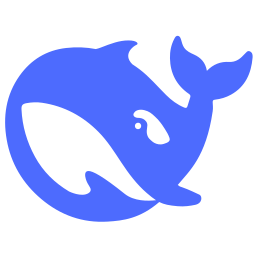

<div align="center">



# DeepSeek Harness (DSH) Docker 增强版

[](https://github.com/deltrivx/deepseek-harness/stargazers)
[](https://github.com/deltrivx/deepseek-harness/network)
[](https://github.com/deltrivx/deepseek-harness/issues)
[](https://github.com/deltrivx/deepseek-harness/releases)
[](https://github.com/deepseek-ai/deepseek-harness)
[](https://github.com/deltrivx/deepseek-harness/pkgs/container/deepseek-harness)
[](LICENSE)

**面向 NAS、私有云与局域网环境的开箱即用 DeepSeek Harness (DSH) 容器化部署增强方案**

[English](README.en.md) | [简体中文](README.md) | [更新日志](CHANGELOG.md) | [参与贡献](CONTRIBUTING.md)

</div>

---

## 📖 项目简介

[DeepSeek Harness (`dsh`)](https://github.com/deepseek-ai/deepseek-harness) 是由 DeepSeek 官方开源的新一代智能体运行时（采用 Everything-is-a-Plugin 架构，基于 Cordis 核心驱动）。

由于官方目前出于本地单机开发的安全考虑，Web 服务强制绑定 `127.0.0.1` 回环地址，导致直接在 NAS、私有云或远程服务器部署时外部网络无法访问。

**本项目旨在提供全套开箱即用的工程化容器方案**：
- 完美解决局域网/公网访问痛点；
- 保持与官方上游版本严格同步（当前已对齐 **`v0.1.6-alpha.1`**）；
- 提供自动化云端多架构构建、安全沙箱隔离以及针对 Unraid、飞牛 fnOS、群晖等平台的专属模板。

---

## 🌟 核心特性

- 🚀 **突破回环访问限制**：内置轻量原生 Node.js 流式反向代理，无缝桥接并完整支持 HTTP 与 WebSocket 协议，无需手动折腾外部 Nginx 即可从局域网或内网穿透直接访问。
- 📦 **全自动多架构支持**：由 GitHub Actions 驱动自动化构建，提供 `linux/amd64` 与 `linux/arm64` 原生镜像，免除在低功耗 NAS 上本地编译的高昂耗时。
- 🏷️ **版本严格对齐上游**：镜像版本标签与上游官方源码发布严格对应，杜绝环境碎片化。
- 🛡️ **沙箱与权限隔离**：预设容器安全规范，将智能体运行时操作目录 (`/workspace`) 与核心配置密钥目录 (`/root/.dsh`) 清晰解耦，保障宿主机数据资产安全。
- 🖥️ **全系 NAS 深度适配**：自带开箱即用的 Unraid CA XML 模板与 Docker Compose 部署模版。

---

## 🚀 快速上手

### 方式一：Docker Compose（推荐）

在服务器或 NAS 上创建 `docker-compose.yml`：

```yaml
services:
  deepseek-harness:
    image: ghcr.io/deltrivx/deepseek-harness:v0.1.6-alpha.1 # 或 latest
    container_name: deepseek-harness
    restart: unless-stopped
    ports:
      - "3080:3080" # Web UI 外部访问端口
    environment:
      - TZ=Asia/Shanghai
      - PORT=3080
      - DSH_PORT=3018
    volumes:
      - ./data:/root/.dsh        # DSH 核心配置、密钥与插件持久化
      - ./workspace:/workspace   # 供智能体读写代码与文件的根工作区
    working_dir: /workspace
```

启动服务：
```bash
docker compose up -d
```

---

### 方式二：Docker CLI 单行运行

```bash
docker run -d \
  --name deepseek-harness \
  --restart unless-stopped \
  -p 3080:3080 \
  -e TZ=Asia/Shanghai \
  -v /mnt/user/appdata/deepseek-harness/data:/root/.dsh \
  -v /mnt/user/appdata/deepseek-harness/workspace:/workspace \
  ghcr.io/deltrivx/deepseek-harness:v0.1.6-alpha.1
```

启动完成后，打开浏览器访问：`http://<宿主机IP>:3080` 即可畅享 DeepSeek Harness。

> 本镜像的 WebUI 代理会自动监听 `0.0.0.0:3080`，因此不需要额外配置 Nginx、域名或反向代理；在局域网内直接访问 `http://<宿主机IP>:3080` 即可。代理还会把页面标题统一显示为 **DeepSeek Harness**，并处理浏览器断开连接时的上游 `ECONNRESET`，避免配置页或设置页被连接重置打断。

> 配置文件与凭据保存在 `/root/.dsh` 挂载目录中。Unraid 没有桌面文本编辑器时，“打开配置文件”无法调用宿主机原生编辑器；本镜像提供浏览器编辑回退地址：先登录 WebUI，再访问 `http://<宿主机IP>:3080/__dsh-config`。保存前会自动创建 `settings.yaml.bak-*` 备份。不要在 Unraid 模板中覆盖 `/entrypoint.sh` 或 `/app/proxy.cjs`，否则旧的启动脚本可能覆盖镜像内已修复的代理。

---

## ⚙️ 持久化目录与存储设计

| 宿主机推荐路径 | 容器内挂载点 | 读写权限 | 作用与说明 |
| :--- | :--- | :--- | :--- |
| `appdata/deepseek-harness/data` | `/root/.dsh` | `rw` | 存放模型提供商配置、API 密钥、插件配置与持久化状态 |
| `appdata/deepseek-harness/workspace` | `/workspace` | `rw` | 智能体工作目录，可挂载你的本地项目仓库供其分析与编写代码 |

---

## 🧩 Unraid 平台快速安装

1. 将仓库 `templates/unraid-template.xml` 导入 Unraid 的 Docker 模板目录，或通过 Community Applications 模板安装。
2. 镜像地址填写：`ghcr.io/deltrivx/deepseek-harness:latest`。
3. 容器图标已自动关联 256x256 高清 PNG 图标（避免 Unraid 无法解析 SVG 导致图标变问号），保持原生美观统一。

---

## 🛠️ 项目结构

```text
deepseek-harness/
├── .github/
│   └── workflows/
│       └── docker-build-ghcr.yml   # 自动化多架构构建与多版本发布工作流
├── assets/
│   └── icon.png                    # 256x256 高清点阵图标（完美兼容 NAS 与各平台）
├── docker/
│   ├── Dockerfile                  # Node 22 环境与多阶段纯净构建定义
│   ├── entrypoint.sh               # 容器初始化守护进程
│   └── proxy.js                    # 轻量 HTTP/WebSocket 网络桥接代理
├── templates/
│   ├── docker-compose.yml          # 开箱即用 Compose 模板
│   └── unraid-template.xml         # Unraid 官方规范容器应用模板
├── CHANGELOG.md                    # 版本演进记录
├── CONTRIBUTING.md                 # 开发者贡献规范
├── README.md                       # 中文完整指南
├── README.en.md                    # 英文文档
└── LICENSE                         # MIT 许可证
```

---

## 🤝 参与贡献与开发

欢迎提交 Issue 和 Pull Request！
在提交 PR 之前，请阅读 [CONTRIBUTING.md](CONTRIBUTING.md)。

---

## 📄 鸣谢与许可

- 本项目采用 [MIT License](LICENSE) 开源。
- DeepSeek Harness 核心属于 [deepseek-ai/deepseek-harness](https://github.com/deepseek-ai/deepseek-harness) 团队所有。
